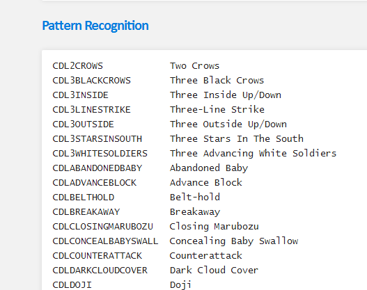

* content
{:toc}

本文汇总关于量化方面的开源资源
### 1.Talib
[talib](https://github.com/loochao/talib-document):主要是因子库的汇总
[talib 说明文档](http://mrjbq7.github.io/ta-lib/index.html)
技术派的形态识别：

### 2.JAQS
[JAQS](https://github.com/xingetouzi/JAQS/tree/fxdayu)是一个开源量化策略研究平台，由交易专家和金融技术专家共同设计，实现了自动化信号研究、高效策略开发和多维度回测分析，支持Alpha、CTA、套利等策略的实现。JAQS从实战而来，经实盘检验，本地化开发部署，保障策略安全。
[说明文档](http://jaqs.readthedocs.io/zh_CN/latest/user_guide.html#id40)
> SignalDigger
> SignalDigger.signal_data 输出: 由pd.DataFrame - MultiIndex到
        Index is pd.MultiIndex ['trade_date', 'symbol'], columns = ['signal', 'return', 'quantile','upside_ret','downside_ret']其中upside_ret为持有期period时间段的最高涨幅，downside_ret为持有期period时间段内的最大跌幅，signal：因子,quantile:
> 输入：obj.process_signal_before_analysis(signal=dv.get_ts("pb") 因子,
                                   price=dv.get_ts("close_adj") 收盘价,
                                   high=dv.get_ts("high_adj")最高价, # 可为空
                                   low=dv.get_ts("low_adj")最低价,# 可为空
                                   n_quantiles=5,# quantile分类数
                                   mask=mask,# 过滤条件非指数成分
                                   can_enter=can_enter,# 是否能进场未涨停未停牌
                                   can_exit=can_exit,# 是否能出场未跌停未停牌
                                   period=15,# 持有期
                                   benchmark_price=dv.data_benchmark, # 基准价格 可不传入，持有期收益（return）计算为绝对收益
                                   commission = 0.0008,
                                   )
> 这个输出值的作用：可用于快速求"ic"，选股收益"ret"，最大潜在盈利/亏损分析"space"：jaqs.research.analysis.analysis

### 3.WorldQuant Alpha 101
[101因子](https://mp.weixin.qq.com/s/Vhx46POdIcmCPmVPWtE9Sg):汇集了所有的因子说明

### 4.基础数据处理方法
[可参考](https://mp.weixin.qq.com/s/0Evg4GsckytNW_32Ih78fQ)

### 5.IV计算
[信息价值](https://zhuanlan.zhihu.com/patrickyu/20603744)
[信息价值的含义](http://blog.csdn.net/kevin7658/article/details/50780391)

[外汇多因子分析](https://wallstreetcn.com/articles/292273)